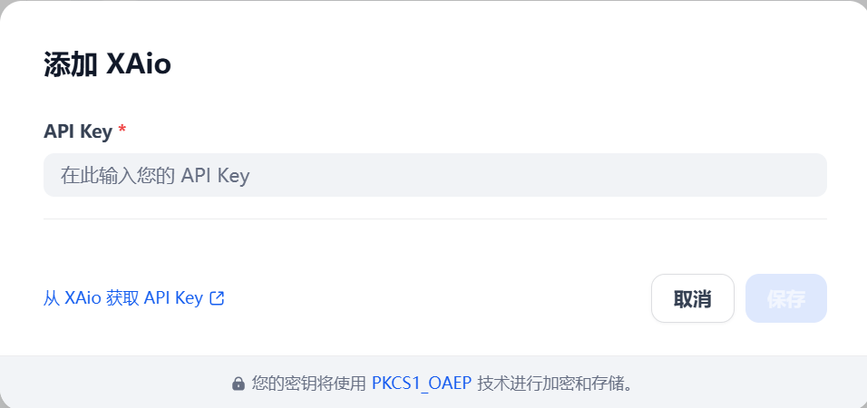

# Overview
X-Aio provides high-performance, low-cost multi-category model services via the API. Currently, a number of high-quality open source models are online, bringing users an ultra-high performance experience without having to worry about high computing costs.

# Configure
After installation, you need to get API keys from [X-Aio](https://dashboard.x-aio.com/en/home/API) and setup in Settings -> Model Provider.

# Issue Feedback
If you have issues that need feedback, feel free to raise questions or look for answers in the [Issue](https://github.com/Yeaosound/x-aio-dify-plugin/issues) section.

