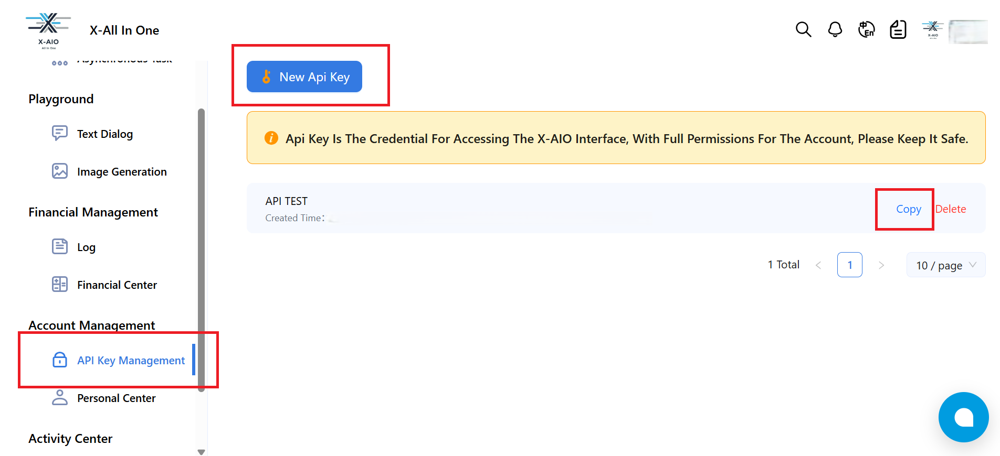

# Overview
X-Aio provides high-performance, low-cost multi-category model services via the API. Currently, a number of high-quality open source models are online, bringing users an ultra-high performance experience without having to worry about high computing costs.

## Preset Models

### 1. Large Language Models (LLM)

- **GLM-4.1V-9B-Thinking** 
- **Qwen3-235B-A22B** 
- **Qwen3-14B** 
- **Qwen2.5-VL-32B-Instruct** 
- **Qwen3-235B-A22B-Thinking-2507** 
- **Qwen2.5-VL-32B-Instruct-2507** 
- **deepseek-r1** 
- **deepseek-reasoner** 
- **deepseek-chat**
- **Qwen3-30B-A3B-Instruct-2507** 
- **Qwen3-30B-A3B-Thinking-2507**

### 2. Text Embedding Models

- **bge-m3** 
- **xaio-embedding**
- **Qwen3-Embedding-8B**

### 3. Reranking Models

- **bge-reranker-v2-m3** 
- **xaio-rerank**
- **Qwen3-Reranker-8B**

## Configure
### How to Obtain a X-Aio API Key

1. Visit [X-Aio](https://dashboard.x-aio.com/) official website, register and log in to your account
2. Click "API Key Management" in the left menu
3. Click "New Api Key", copy and save the generated API key

### After installation, you need to get API keys from [X-Aio](https://dashboard.x-aio.com/en/home/API) and setup in Settings -> Model Provider.

During usage, you may need to pay the API service provider. Please refer to X-AIO's relevant pricing policy for detailed fee information.

## Issue Feedback
If you have issues that need feedback, feel free to raise questions or look for answers in the [Issue](https://github.com/Yeaosound/x-aio-dify-plugin/issues) section.

## Privacy Policy
https://dashboard.x-aio.com/en/agreeDocument